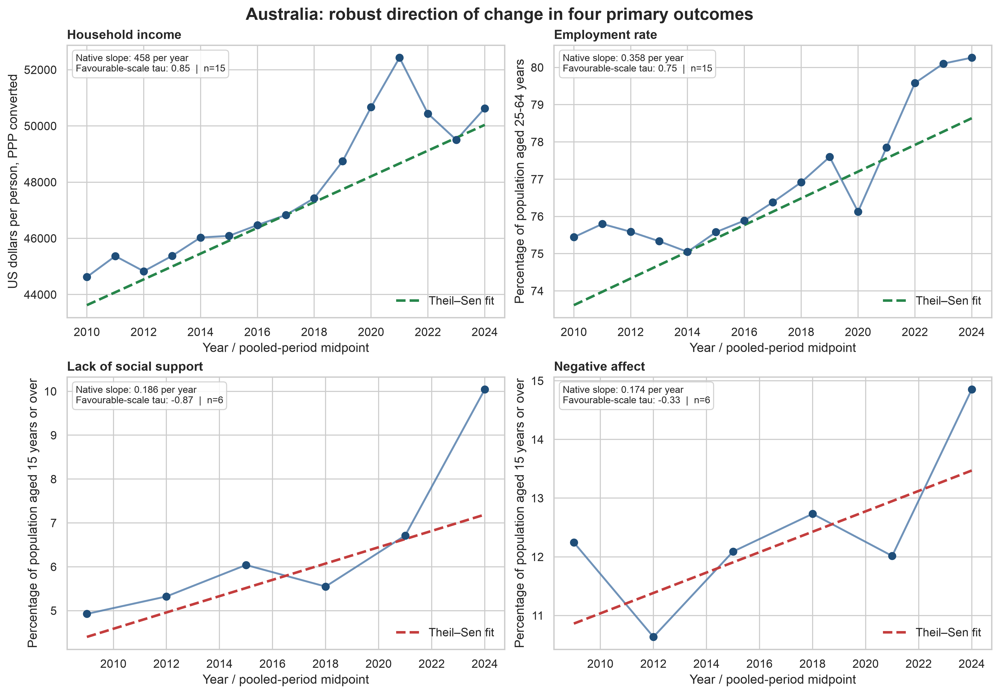
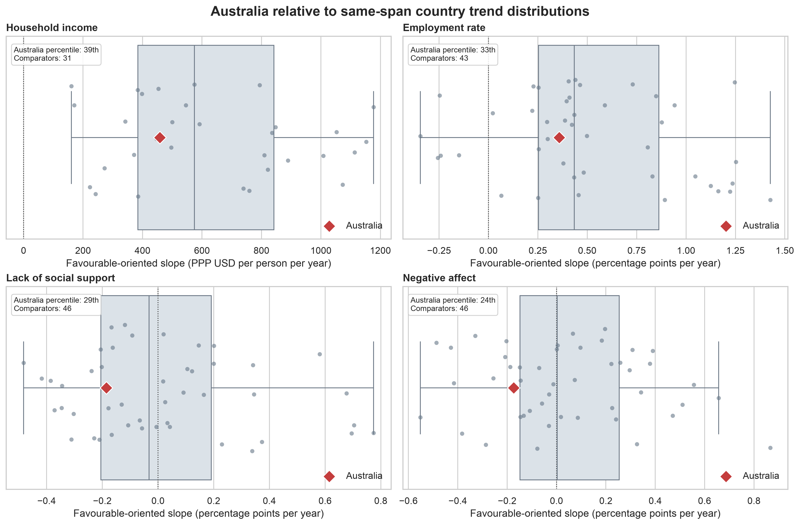

<style>
.economic-comparison {
  margin: 1.25rem 0 1.75rem;
  width: 100%;
  max-width: 100%;
}

.economic-comparison table {
  width: 100%;
  table-layout: fixed;
  font-size: 0.88rem;
}

.economic-comparison th,
.economic-comparison td {
  padding: 0.8rem 0.7rem;
  vertical-align: top;
  line-height: 1.45;
}

.economic-comparison th {
  border-bottom: 2px solid #6c757d;
  font-weight: 650;
}

.economic-comparison tbody tr:nth-child(even) {
  background-color: #f6f8fa;
}

.economic-comparison th:nth-child(1),
.economic-comparison td:nth-child(1) { width: 16%; }
.economic-comparison th:nth-child(2),
.economic-comparison td:nth-child(2) { width: 11%; text-align: right; }
.economic-comparison th:nth-child(3),
.economic-comparison td:nth-child(3) { width: 16%; text-align: right; }
.economic-comparison th:nth-child(4),
.economic-comparison td:nth-child(4) { width: 17%; text-align: right; }
.economic-comparison th:nth-child(5),
.economic-comparison td:nth-child(5) { width: 40%; text-align: left; }

.economic-comparison col:nth-child(1) { width: 15% !important; }
.economic-comparison col:nth-child(2) { width: 12% !important; }
.economic-comparison col:nth-child(3) { width: 15% !important; }
.economic-comparison col:nth-child(4) { width: 16% !important; }
.economic-comparison col:nth-child(5) { width: 42% !important; }

.trajectory-figure img {
  display: block;
  width: 100%;
  max-width: 100%;
  height: auto;
  margin: 0 auto;
}

.primary-scorecard table {
  width: 100%;
  table-layout: fixed;
  font-size: 0.82rem;
}

.primary-scorecard th,
.primary-scorecard td {
  padding: 0.5rem 0.45rem;
  vertical-align: top;
  white-space: normal;
}

.primary-scorecard th:first-child,
.primary-scorecard td:first-child { width: 24%; text-align: left; }

.primary-scorecard th:not(:first-child),
.primary-scorecard td:not(:first-child) { text-align: right; }

.trend-scorecard table {
  width: 100%;
  table-layout: fixed;
  font-size: 0.66rem;
}

.trend-scorecard th,
.trend-scorecard td {
  padding: 0.38rem 0.22rem;
  vertical-align: top;
  white-space: normal;
  overflow-wrap: break-word;
}

.trend-scorecard th:first-child,
.trend-scorecard td:first-child {
  width: 19%;
  text-align: left;
}

.trend-scorecard th:not(:first-child),
.trend-scorecard td:not(:first-child) { text-align: right; }

.trend-scorecard th:nth-child(2),
.trend-scorecard td:nth-child(2) { width: 15%; }

.trend-scorecard th:nth-child(3),
.trend-scorecard td:nth-child(3) { width: 10%; }

.trend-scorecard th:nth-child(4),
.trend-scorecard td:nth-child(4) { width: 9%; }

.trend-scorecard th:nth-child(5),
.trend-scorecard td:nth-child(5),
.trend-scorecard th:nth-child(6),
.trend-scorecard td:nth-child(6) { width: 7%; }

.trend-scorecard th:nth-child(7),
.trend-scorecard td:nth-child(7) { width: 5%; }

.trend-scorecard th:nth-child(8),
.trend-scorecard td:nth-child(8) { width: 10%; }

.trend-scorecard th:nth-child(9),
.trend-scorecard td:nth-child(9) { width: 8%; }

.trend-scorecard th:nth-child(10),
.trend-scorecard td:nth-child(10) { width: 10%; }

.trend-agreement table {
  width: 100%;
  table-layout: fixed;
  font-size: 0.80rem;
}

.trend-agreement th,
.trend-agreement td {
  padding: 0.45rem 0.4rem;
  vertical-align: top;
  white-space: normal;
}

.trend-agreement th:first-child,
.trend-agreement td:first-child { width: 22%; text-align: left; }

.trend-agreement th:not(:first-child),
.trend-agreement td:not(:first-child) { text-align: right; }
</style>

## Executive summary

**Research question:** As Australia's material conditions improved, did
perceived social support and emotional well-being deteriorate relative to
comparable countries?

The evidence supports a **material--social tension**, but not a causal claim.
Australia's income and employment increased from 2010 to 2024, while perceived
lack of social support more than doubled and negative affect rose across the
independent pooled survey windows. Australia deteriorated more than the typical
supplied-country comparator on both social outcomes.

> **Australia became materially better resourced, while perceived social
> support and emotional well-being worsened relative to comparable countries.**

## Introduction
### Background

Typically, a country’s success is measured mainly on economic indicators. However, looking exclusively at material wealth does not adequately reflect people’s true lives and experiences. In particular, income and employment may steadily improve as a country improves. The development in other areas like health, social relationships or well-being are difficult to foresee. So a larger assessment must take into consideration both material situations and people's life experiences.

This report is based on data from the Organisation for Economic Cooperation and Development’s **How’s Life?** database. It assesses the material wealth, quality of life, and community-related aspects of a nation's well-being. Income and wealth, employment, housing, work-life balance, health, education, social connections, political involvement, environmental quality, and subjective well-being are all included. 

The `OECD Data.csv` raw dataset includes 8,806 observations from 47 countries, covering 21 indicators and 10 domains of well-being. And Australia is included alongside a range of international comparators. The data are arranged as a time series, which allows this study to assess changes in Australia over time and compare its performance with that of nations that reported the same indicators over the same period.

The data's major analysis period spans from 2010 to 2024. Instead of being considered as distinct annual measurements, these observations are labelled according to their entire survey window.

## Data cleaning and preprocessing

### Brief Workflow
The raw `OECD Data.csv` file was preserved unchanged. The data preparation section is performed using all functions in **Audit** section. The `data/processed` directory will include the cleaned and examined datasets.

We checked the raw dataset for duplicate entries, missing observations, data types, and expected columns. We made sure that there were no missing values in the principal observation field, no entirely duplicate rows, and no duplicate country-indicator-year keys.

This table summaries a simple data cleaning steps. 

```{python}
from __future__ import annotations

import subprocess
import sys
from pathlib import Path

import numpy as np
import pandas as pd
from IPython.display import display


def project_root() -> Path:
    for candidate in (Path.cwd(), *Path.cwd().parents):
        if (candidate / "data" / "raw" / "OECD Data.csv").exists():
            return candidate
    raise FileNotFoundError("Could not locate data/raw/OECD Data.csv.")


ROOT = project_root()
sys.path.insert(0, str(ROOT))

from src.oecd_audit import INDICATOR_SPECS, load_clean  # noqa: E402


RAW_FILE = ROOT / "data" / "raw" / "OECD Data.csv"
data = load_clean(RAW_FILE)

assert not data.duplicated(
    ["country_code", "indicator_code", "year"]
).any()
assert data.value.notna().all()


cleaning_summary = pd.DataFrame(
    [
        {
            "Stage": "Raw input",
            "What we did": (
                f"{len(data):,} country-indicator-year observations across "
                f"{data.country_code.nunique()} countries and "
                f"{data.indicator_code.nunique()} indicators"
            ),
            "Why it matters": "Preserved unchanged",
        },
        {
            "Stage": "Structure check",
            "What we did": (
                "Country-indicator-year keys are unique; "
                "observed values are complete"
            ),
            "Why it matters": "Validated before analysis",
        },
        {
            "Stage": "Analysis-ready data",
            "What we did": (
                "Selected required fields, renamed columns, and converted "
                "year and value to numeric types"
            ),
            "Why it matters": "No observations imputed or dropped",
        },
        {
            "Stage": "Quality metadata",
            "What we did": (
                "Retained OECD observation-status flags "
                f"({int(data.is_flagged.sum())} flagged observations) "
                "and indicator directions"
            ),
            "Why it matters": "Used in sensitivity checks",
        },
        {
            "Stage": "Time handling",
            "What we did": (
                "Annual outcomes analysed through 2024; pooled Gallup "
                "outcomes collapsed to independent three-year windows"
            ),
            "Why it matters": "Avoids false annual precision",
        },
    ]
)


display(
    cleaning_summary.style
    .hide(axis="index")
    .set_caption("Data cleaning and preparation summary")
)
```

### Column selection and standardisation
We chose and kept the fields required for the challenge after examining the raw data files. These consist of base periods, welfare domains, reference years, observed values, units, country and indicator codes and labels, and OECD observation status data. The retained columns were given the readable names to make reading and further analysis easier. Additionally, we standardised data formats, eliminated leading and trailing spaces from text fields, and substituted `NA` for `_Z`.

### Data quality information
In the 2010-2024 processing dataset, 8,321 of the 8,575 records were categorised as normal, with 254 receiving quality warnings. The flagged records consisted of 39 time-series breakdowns, 45 definition inconsistencies, 85 estimates, and 85 tentative values. To prevent utilising these missing values in later studies, we created a Boolean quality parameter to detect them during sensitivity checks.

The audit workflow also gave each indicator a positive direction. Higher levels of employment and income, for instance, are viewed favourably, but higher levels of unpleasant emotions and a lack of social support are viewed unfavourably. This permits worldwide rankings and adjustments to be expressed uniformly while maintaining the original values of the indicators.

### Scope and validation
The cleaned dataset was restricted to the period of 2010-2014 and export as `OECD_cleaned_version.csv`. Finally, it contains 8,575 observations covering 47 countries, 21 indicators and 10 domains.

The reusable audit workflow `` performs the validation of missing required columns, missing observation values, duplicate country–indicator–year keys or unrecognised indicators cause the workflow to stop with an error.

Therefore, the tidy structure ensures that:

- each row represents one country, indicator and displayed year
- each country code corresponded to one country name
- each indicator had a consistent name, domain and unit
- the required analytical fields contained no missing values
- country–indicator–year keys were unique


### Processed outputs

Finally, the data cleaning and reprocessing conducts the following dataset:
- `OECD_cleaned_version.csv`: the notebook’s tidy 2010–2024 dataset
- `oecd_clean.csv`: the validated analysis dataset with indicator direction, quality flags and independent-period labels
- `OECD_categories.csv`: a summary of indicators, units and coverage within each domain
- `OECD_domain_counts.csv`: overall domain coverage ranked by observation count
- `AU_domain_counts.csv`: the equivalent domain-coverage summary for Australia

### Audit safeguards for the research question

The reproducible audit in `src/oecd_audit.py` revalidates the unchanged raw
file and rejects missing required values, duplicate keys and undocumented
indicators; no values are imputed. It also prevents the two main comparison
errors: countries are compared only within the same indicator and year, and 16
displayed social rows are treated as six independent pooled windows. Income and
employment have no internal Australian annual gaps. These safeguards support
the four-outcome design; detailed audit outputs and coverage limitations are in
the Appendix.


## Exploratory analysis and question selection

### Candidate research domains
After cleaning the data, we prioritised three areas based on topic coverage rankings: economic situations, health, and subjective well-being. We also evaluated the connections between social interactions, work and work quality, and other relevant domains. This phase was used to investigate specific concerns for which there was enough data to make international comparisons.

#### Economic
The economic investigation took into the aspects of household income, enployment, gender wage gap, long working hours and income inequality.

There are the significant improvements of Australia's living standards and the labor market. Between 2010 and 2024, per capita household income increased by $6,004, while the employment rate rose by 4.82 percentage points. The proportion of employees working long hours decreased by 3.81 percentage points, and the gender wage gap also narrowed.

However, Australia’s improvements in income and employment did not consisently exceed the median across a board range of comparable countries. Only the available S80/S20 income ratio slightly changed between 2010 and 2024.

::: {.economic-comparison}
```{python}
economic_comparison = pd.DataFrame([
    {
        "Indicator": "Household income per person, PPP",
        "Australia’s change": "+USD 6,004",
        "English-speaking reference": "+USD 5,218 median (3 peers)",
        "Broad supplied-country reference": "+USD 6,960 median (31 countries)",
        "Interpretation": (
            "A substantial domestic gain. It exceeds the small-peer median "
            "but not the broad median; the small-peer result changes when "
            "individual peers are omitted."
        ),
    },
    {
        "Indicator": "Employment rate",
        "Australia’s change": "+4.82 pp",
        "English-speaking reference": "+5.17 pp median (4 peers)",
        "Broad supplied-country reference": "+5.68 pp median (43 countries)",
        "Interpretation": (
            "Employment improved in Australia, but its improvement was not "
            "faster than either reference median."
        ),
    },
    {
        "Indicator": "Gender wage gap",
        "Australia’s change": "−3.37 pp",
        "English-speaking reference": "−2.60 pp median (4 peers)",
        "Broad supplied-country reference": "−3.23 pp median (29 countries)",
        "Interpretation": (
            "A favourable reduction, with broadly middle-of-the-distribution "
            "comparative change."
        ),
    },
    {
        "Indicator": "Long-hours share",
        "Australia’s change": "−3.81 pp",
        "English-speaking reference": "−1.80 pp median (4 peers)",
        "Broad supplied-country reference": "−2.01 pp median (39 countries)",
        "Interpretation": (
            "Australia’s improvement is stronger than both benchmarks. Its "
            "2024 level remains above the English-speaking-peer median: "
            "10.18% versus 9.20%."
        ),
    },
    {
        "Indicator": "S80/S20 income inequality, 2012–20",
        "Australia’s change": "+0.04",
        "English-speaking reference": "—",
        "Broad supplied-country reference": "—",
        "Interpretation": (
            "Essentially flat to slightly worse; the supplied data do not "
            "show that average gains were more equally shared."
        ),
    },
])

display(
    economic_comparison.style
    .hide(axis="index")
    .set_caption("Economic outcomes compared with reference groups")
)
```
:::

#### Health
The health investigation took into the aspects of life expectancy and suicide, alcohol and drugs death.

Australian life expectancy significantly increased and remained above the supplied-country median value. And the combined death increased from 14.9 to 22.2 per 100,000 by 2024.

However, the overall mortality rate metric includes three separate causes of death (social support, subjective well-being and economic), and only 18 nations have supplied data for 2024. As a result, health is viewed as a valuable supporting background rather than the primary focus.

```{python}
health_comparison = pd.DataFrame([
    {
        "Measure": "Life expectancy",
        "Earlier value": "81.7 years (2010)",
        "Latest value": "83.0 years (2023)",
        "Interpretation": "Increased",
    },
    {
        "Measure": "Suicide/alcohol/drug deaths",
        "Earlier value": "14.9 per 100,000 (2010)",
        "Latest value": "22.2 per 100,000 (2024)",
        "Interpretation": "Increased",
    },
    {
        "Measure": "Life expectancy peer comparison",
        "Earlier value": "—",
        "Latest value": (
            "83.0 versus supplied-country median 81.5 (2023)"
        ),
        "Interpretation": "—",
    },
    {
        "Measure": "Harm-death comparison",
        "Earlier value": "—",
        "Latest value": "21.7 versus median 20.3 (2023)",
        "Interpretation": "Slightly worse",
    },
])

display(
    health_comparison.style
    .hide(axis="index")
    .set_caption("Health outcomes and peer comparisons")
)
```

#### Subjective Well-being
The subjective well-being investigation took into the aspects of negative emotions and life satisfaction.

Overall, negative emotions increased from 12.24% between 2008 and 2010 to 14.85% between 2023 and 2025. Australia's rate climbed in the most recent period and exceeded the median, indicating a decline in its relative standing. Life satisfaction decreased from 7.5 in 2019 to 7.2 in 2020. However, with only two data sets available for Australia, this indicator cannot demonstrate a consistent long-term trend.

Negative emotions offer far better temporal and worldwide coverage. Thus, it was chosen as the key measure of emotional well-being.

```{python}
wellbeing_comparison = pd.DataFrame([
    {
        "Measure": "Negative affect balance",
        "Earlier value": "12.24% (2008–10)",
        "Latest value": "14.85% (2023–25)",
        "Interpretation": (
            "Negative emotional experiences became more common"
        ),
    },
    {
        "Measure": "Life satisfaction",
        "Earlier value": "7.5/10 (2019)",
        "Latest value": "7.2/10 (2020)",
        "Interpretation": (
            "Fell by 0.3 points, but only two Australian observations "
            "are available"
        ),
    },
    {
        "Measure": "Negative affect peer comparison",
        "Earlier value": (
            "12.24% versus supplied-country median 12.24% (2008–10)"
        ),
        "Latest value": (
            "14.85% versus supplied-country median 12.39% (2023–25)"
        ),
        "Interpretation": (
            "Australia moved from the median to worse than the median"
        ),
    },
    {
        "Measure": "Life satisfaction peer comparison",
        "Earlier value": (
            "7.5 versus supplied-country median 7.58 (2019)"
        ),
        "Latest value": (
            "7.2 versus supplied-country median 7.30 (2020)"
        ),
        "Interpretation": (
            "Slightly below the median, but only six countries reported "
            "in each year"
        ),
    },
])

display(
    wellbeing_comparison.style
    .hide(axis="index")
    .set_caption("Subjective wellbeing outcomes and peer comparisons")
)
```

#### Cross-references considered

The research also examined several cross-domain relationships:
- Economic and social connections
- Economic and subjective well-being
- Health and subjective well-being
- Health and work and job quality
- Subjective well-being and employment conditions
- Subjective well-being and income and wealth
- Subjective well-being and social connections

The correlation between **subjective well-being** and **social connections** appeared to be the best fit. The absence of social support and negative feelings have in common six Gallup combined windows and are broadly represented in all 47 countries that belong to the database. It provides an opportunity to compare these two dependent variables without applying any interpolation techniques or finding equivalent time frames.

### Selection of social connections
Low social support exhibited the most significant drop, increasing from 4.93% in 2008-10 to 10.04% in 2023-25. Negative affect grew from 12.24% to 14.85%, indicating an increase in problems related to social and emotional aspects. Social support was chosen due to clarity, similarity to negative affect, large change over time, and adequate international availability. Despite the fact that it fails to reflect all social contacts, it offered the best way for comparison. In general, conditions in Australia have become better while social and emotional conditions are worse.

### Development of the research question

We first audited coverage by country, indicator and year, separating genuine
annual gaps from non-annual survey designs. We then examined Australia's latest
position and direction of change using only countries reporting the same
indicator in the same period. This revealed a coherent tension:

- Material resources and employment improved, but income inequality did not
  clearly improve and long-hours work remained comparatively high despite a
  favourable decline.
- Perceived lack of social support and negative affect worsened across the six
  independent Gallup windows.
- Australia has sufficient coverage for household income, employment, lack of
  social support and negative affect to form a focused four-outcome analysis.
  Life satisfaction has only two Australian observations and is therefore not
  used as a long-run primary outcome.

These checks led to the report's research question: whether Australia’s
material progress coexisted with a relative deterioration in perceived social
support and emotional well-being. The question is deliberately descriptive and
does not assume a causal pathway between the two domains.

```{python}
#| output: false
test_run = subprocess.run([sys.executable, "-m", "pytest", "-q"], cwd=ROOT, capture_output=True, text=True)
if test_run.returncode != 0:
    raise RuntimeError("Repository tests failed.")
```

## Methodology

### Method 1: EDA

The four primary outcomes were fixed after the coverage audit and before the
common-endpoint comparison. For each observed period, Australia is plotted in
native units against the median and interquartile range of all other supplied
countries reporting that outcome in the same period. Australia is excluded from
the reference summaries; no values are interpolated and no composite score is
constructed. Reference coverage is 31--36 countries for income, 44--46 for
employment and 46 for each social outcome.

Income and employment are annual. Lack of social support and negative affect
are six independent three-year Gallup windows labelled by their full periods.
The per-period reference composition may change with reporting availability, so
Method 1 establishes patterns and coverage rather than a fixed-panel estimate.
The supplied extract includes non-members and is therefore described as the
*supplied-country reference*, not as an OECD ranking.

### Method 2: Primary common-endpoint comparison

For each outcome, a country is eligible only if it reports both of Australia's
exact endpoints. The native change is
$\Delta_c = y_{c,\mathrm{end}}-y_{c,\mathrm{start}}$. The primary comparative
estimand is $G=s(\Delta_{AUS}-\operatorname{median}(\Delta_c))$, where
$s=1$ for higher-is-better outcomes and $s=-1$ for lower-is-better outcomes.
Thus, positive $G$ always indicates a more favourable Australian change. The
median limits sensitivity to extreme country changes, while native units retain
substantive meaning.

The scorecard also reports the eligible-country count and Australia's
direction-aware percentile, using average ranks for ties. Percentiles describe
relative position; they are not probabilities or significance tests. Rendering
stops if these results differ from the independently generated Method 2 table.
Methods 3--4 assess uncertainty and trend robustness separately.

```{python}
AUSTRALIA = "AUS"
OUTCOMES = {
    "1_1": ("Household income per person, PPP", 2010, 2024, "2010–2024"),
    "2_1": ("Employment rate", 2010, 2024, "2010–2024"),
    "7_1_DEP": ("Lack of social support", 2010, 2024, "2008–10 to 2023–25 pooled windows"),
    "11_2": ("Negative affect", 2010, 2024, "2008–10 to 2023–25 pooled windows"),
}


def endpoint_changes(code: str, start: int, end: int, countries: list[str]) -> pd.DataFrame:
    subset = data.loc[data.indicator_code.eq(code) & data.country_code.isin([AUSTRALIA, *countries]) & data.year.isin([start, end])].copy()
    subset = subset.sort_values("year").drop_duplicates(["country_code", "independent_period"], keep="last")
    wide = subset.pivot(index="country_code", columns="year", values="value").reindex(columns=[start, end]).dropna()
    wide["native_change"] = wide[end] - wide[start]
    sign = 1 if INDICATOR_SPECS[code].direction == "higher" else -1
    wide["oriented_change"] = sign * wide["native_change"]
    return wide


def common_endpoint_scorecard() -> pd.DataFrame:
    references = sorted(set(data.country_code) - {AUSTRALIA})
    rows = []
    for code, (label, start, end, period) in OUTCOMES.items():
        changes = endpoint_changes(code, start, end, references)
        au, peers = changes.loc[AUSTRALIA], changes.drop(index=AUSTRALIA)
        comparator_median = peers.native_change.median()
        rank = changes.oriented_change.rank(ascending=False, method="average").loc[AUSTRALIA]
        n = len(changes)
        sign = 1 if INDICATOR_SPECS[code].direction == "higher" else -1
        rows.append({
            "Indicator code": code,
            "Outcome": label,
            "Period": period,
            "Australia start": au[start],
            "Australia end": au[end],
            "Australia change": au.native_change,
            "Comparator median change": comparator_median,
            "Australia-minus-median favourable gap": sign * (au.native_change - comparator_median),
            "Comparator countries": len(peers),
            "Favourable percentile": 100 * (n-rank)/(n-1),
        })
    return pd.DataFrame(rows)


results = common_endpoint_scorecard()

# Stop rendering if the report diverges from the independently generated Method 2 table.
frozen_path = ROOT / "reports" / "tables" / "material_social_primary_results.csv"
if not frozen_path.exists():
    raise FileNotFoundError("Run notebooks/02_analysis.ipynb before rendering the report.")
frozen = pd.read_csv(frozen_path).set_index("indicator_code")
for _, row in results.iterrows():
    stored = frozen.loc[row["Indicator code"]]
    checks = {
        "Australia start": "australia_start_value",
        "Australia end": "australia_end_value",
        "Australia change": "australia_native_change",
        "Comparator median change": "comparator_median_native_change",
        "Australia-minus-median favourable gap": "australia_minus_comparator_median_oriented",
        "Favourable percentile": "australia_favourable_percentile",
    }
    for report_column, stored_column in checks.items():
        assert abs(row[report_column] - stored[stored_column]) < 1e-10
    assert row["Comparator countries"] == stored["eligible_comparator_country_count"]

scorecard = results[[
    "Outcome", "Australia change", "Comparator median change",
    "Australia-minus-median favourable gap", "Favourable percentile",
    "Comparator countries",
]].copy()
scorecard.columns = [
    "Outcome", "AU change", "Median change", "Favourable gap",
    "Favourable percentile", "Comparators",
]
```

::: {.primary-scorecard}
```{python}
display(
    scorecard.round(2).style
    .hide(axis="index")
    .format({
        "AU change": "{:,.2f}",
        "Median change": "{:,.2f}",
        "Favourable gap": "{:,.2f}",
        "Favourable percentile": "{:.2f}",
    })
    .set_caption("Primary common-endpoint scorecard (changes in native units)")
)
```
:::

### Method 3: Bootstrap uncertainty and placebo ranking

Method 3 asks whether the Method 2 comparator median is sensitive to which
eligible countries are available. For each outcome, Australia's observed
oriented endpoint change is held fixed while the exact eligible comparator
countries are resampled with replacement 10,000 times. Each replicate
recalculates the comparator median and Australia's oriented gap. The resulting
interval is **comparator-country composition sensitivity**, not OECD
survey-sampling uncertainty or a confidence interval around Australia's change.

The placebo calculation expresses the same endpoint comparison from another
viewpoint: every eligible country is treated as focal once and compared with
the median of the remaining countries. Australia's placebo percentile is
therefore an alternative presentation of the Method 2 endpoint percentile, not
independent evidence.

```{python}
from IPython.display import Image

method3_bootstrap_path = ROOT / "reports" / "tables" / "material_social_bootstrap_results.csv"
method3_placebo_path = ROOT / "reports" / "tables" / "material_social_placebo_results.csv"
method3_figure_path = ROOT / "reports" / "figures" / "material_social_comparative_gaps.png"
if not (method3_bootstrap_path.exists() and method3_placebo_path.exists() and method3_figure_path.exists()):
    raise FileNotFoundError("Run notebooks/02_analysis.ipynb to generate Method 3 outputs before rendering.")

method3_bootstrap = pd.read_csv(method3_bootstrap_path)
method3_placebo = pd.read_csv(method3_placebo_path)
method3_order = ["1_1", "2_1", "7_1_DEP", "11_2"]
expected_counts = [31, 43, 46, 46]
for table in (method3_bootstrap, method3_placebo):
    assert table.indicator_code.tolist() == method3_order
    assert table.indicator_code.is_unique
    assert table.eligible_comparator_country_count.tolist() == expected_counts

assert method3_bootstrap.bootstrap_replicates.eq(10_000).all()
assert method3_bootstrap.random_seed.eq(20260720).all()
assert (method3_bootstrap.bootstrap_ci_lower <= method3_bootstrap.bootstrap_ci_upper).all()
assert method3_figure_path.stat().st_size > 0

method3_check = method3_bootstrap.merge(
    frozen[["australia_minus_comparator_median_oriented"]],
    left_on="indicator_code", right_index=True, validate="one_to_one"
)
np.testing.assert_allclose(
    method3_check.observed_oriented_gap,
    method3_check.australia_minus_comparator_median_oriented,
    atol=1e-10,
)
np.testing.assert_allclose(
    method3_placebo.australia_favourable_percentile,
    frozen.loc[method3_order, "australia_favourable_percentile"],
    atol=1e-10,
)

method3_display = method3_bootstrap.merge(
    method3_placebo[["indicator_code", "australia_favourable_percentile"]],
    on="indicator_code", validate="one_to_one"
)[[
    "indicator", "observed_oriented_gap", "bootstrap_ci_lower", "bootstrap_ci_upper",
    "australia_favourable_percentile", "eligible_comparator_country_count", "sensitivity_label",
]].copy()
method3_display.columns = [
    "Outcome", "Oriented gap", "Bootstrap 2.5%", "Bootstrap 97.5%",
    "Favourable percentile", "Comparators", "Sensitivity",
]
display(method3_display.round(2))
display(Image(filename=str(method3_figure_path)))
```

Income and employment intervals cross zero, so their relative endpoint gaps
are comparator-sensitive. The social-support and negative-affect intervals
remain below zero, making their adverse relative changes comparatively stable
to this resampling of the eligible-country set. This does not establish a
population parameter or causal mechanism; it calibrates how strongly the
descriptive cross-country comparison can be stated.


### Method 4: Theil–Sen and Kendall trend robustness

For each primary outcome, the Theil--Sen estimator summarises Australia's
median pairwise rate of change across the full trajectory. Annual material
series use 2010--2024; the social series use six independent pooled-window
midpoints. Country slope comparisons require Australia's start and endpoint
and at least 80% of its independent periods. Slopes and Kendall's tau are
oriented so positive is favourable, and Holm adjustment is applied across the
four pre-specified Australian tau tests.

Tau describes monotonic ordering, while its p-value tests the null of no
ordinal association. Standard Kendall p-values and Theil--Sen intervals do not
model temporal dependence, so they are exploratory diagnostics rather than
decisive significance tests. The primary robustness evidence is the slope's
magnitude, direction, coverage, international position and agreement with the
common-endpoint result.

#### Endpoint-versus-trend results
::: {.trend-scorecard}
```{python}
trend_scorecard = pd.DataFrame([
    {
        "Outcome": "Household income",
        "Native Theil–Sen slope": "+USD 458 per person/year",
        "Direction": "Favourable",
        "Favourable Kendall’s tau": "+0.85",
        "Raw p-value": "<0.0001",
        "Holm-adjusted p-value": "<0.0001",
        "Independent observations": 15,
        "Comparator slope percentile": "38.7th",
        "Eligible comparators": 31,
        "Endpoint agreement": "Yes",
    },
    {
        "Outcome": "Employment rate",
        "Native Theil–Sen slope": "+0.358 pp/year",
        "Direction": "Favourable",
        "Favourable Kendall’s tau": "+0.75",
        "Raw p-value": "<0.0001",
        "Holm-adjusted p-value": "<0.0001",
        "Independent observations": 15,
        "Comparator slope percentile": "32.6th",
        "Eligible comparators": 43,
        "Endpoint agreement": "Yes",
    },
    {
        "Outcome": "Lack of social support",
        "Native Theil–Sen slope": "+0.186 pp/year",
        "Direction": "Unfavourable",
        "Favourable Kendall’s tau": "−0.87",
        "Raw p-value": "0.0167",
        "Holm-adjusted p-value": "0.0333",
        "Independent observations": 6,
        "Comparator slope percentile": "28.3rd",
        "Eligible comparators": 46,
        "Endpoint agreement": "Yes",
    },
    {
        "Outcome": "Negative affect",
        "Native Theil–Sen slope": "+0.174 pp/year",
        "Direction": "Unfavourable",
        "Favourable Kendall’s tau": "−0.33",
        "Raw p-value": "0.4694",
        "Holm-adjusted p-value": "0.4694",
        "Independent observations": 6,
        "Comparator slope percentile": "23.9th",
        "Eligible comparators": 46,
        "Endpoint agreement": "Yes",
    },
])

trend_scorecard_display = trend_scorecard.rename(columns={
    "Native Theil–Sen slope": "Theil–Sen slope",
    "Favourable Kendall’s tau": "Kendall’s tau",
    "Raw p-value": "Raw p",
    "Holm-adjusted p-value": "Holm p",
    "Independent observations": "n",
    "Comparator slope percentile": "Slope percentile",
    "Eligible comparators": "Comparators",
    "Endpoint agreement": "Endpoint agrees",
})

display(
    trend_scorecard_display.style
    .hide(axis="index")
    .set_caption("Primary trend scorecard")
)
```
:::

*Notes: Native positive slopes mean increases in the original indicators. Due to lower values are represented to the lack of social support and negative affect, thus native positive slopes refer to deterioration. "Comparator slope percentile" is calculated after aligning all slopes so that greater values are preferable. pp = percentage points.*


#### Australia’s robust trend trajectories
::: {.trajectory-figure}
{#fig-method4-australia-trends width=100%}
:::

This figure shows the observed trajectories and fitted Theil–Sen trends for four key outcomes in Australia. The solid lines connect the individual observations, and dash lines represent robust trend estimates.

Positive tendencies can be observed in the two upper graphs. The average income of households increased by about $458 annually, showing a strong positive monotonic trend $\tau = 0.85$. The employment rate increased by approximately 0.358% per year, reflecting a strong positive trend $\tau=0.75$. Both trends had identical p-values, which were less than 0.0001.

Income went down since having reached its maximum value in 2021, whereas employment showed strong recovery after its decline in 2020. Gradients of both fitted lines remained positive and reflect good developments at their endpoints. Consequently, Australia's successful development cannot be solely attributed to the comparison of initial and the last point.

Two lower graphs show a deterioration of the social impact. Lack of social support increases by approximately 0.186% per year. Since smaller values indicate more positive influence on society, the Kendall's coefficient calculated on the scale of improvement will be -0.87. It means strong negative monotonic order across six independent aggregation windows. Unadjusted p-value is equal to 0.0167, while p-value after Holm correction is 0.0333. However, the estimation of the pooling effect is extremely important in 2023-25.

In terms of the negative side of the scale, the negative emotions increase by about 0.174 percentage points annually. For the positive side, the value of tau equals to -0.33 which means that there is a smaller monotonically increasing trend. But what can be seen from the trend graph is the decrease in negative emotions in some middle periods and their rapid increase between 2023 and 2025. The values of p are 0.4694 both for the unadjusted version and Holm’s correction.

#### Australia relative to country trend distributions
::: {.trajectory-figure}
{#fig-method4-country-slopes width=100%}
:::

This figure depicts the comparison between the Theil–Sen slope for Australia and the distribution of slopes in other countries meeting the same criteria of endpoints and 80% coverage. All of the slopes are shifted to the right, which implies favorable changes. Gray dots denote eligible comparison countries; box plots provide the distributions of the countries, while orange diamonds denote Australia.

According to the upper plots, material trends in Australia are favorable but inferior to those in other eligible comparison countries. The slope of household income in Australia lies on the 39th percentile out of 31 comparison countries, whereas the employment slope of the country is on the 33rd percentile out of 43 comparison countries. It means that Australia has achieved good results, but the slope distribution among the countries shows that it is not one of the best performers on many indicators.

According to the lower plots, Australia also underperforms other comparison countries on these two social measures. Slope for lack of social support is on the 28th percentile of favorable slope among the 46 comparison countries, while the slope for negative emotions is on the 24th percentile out of the same number of comparison countries. As the x-axis corresponds to favorable outcomes, Australia’s position to the left from zero point indicates degradation.

The trend percentile for lack of social support is more favorable than the endpoint result at about the 9th percentile. This implies that the very poor endpoint result that Australia had in lack of social support could be attributed to the rise in the most recent consolidation period. However, both trend approaches reveal that there is worsening in lack of social support. The Kendall’s coefficient for the negative emotions indicator, despite being low, still exhibits consistency in slope and endpoint results.

The two figures clearly shows that the trend percentiles are consistent with endpoint measures of all the four robust indicators. There is improvement in income and employment trends, but the trends are below median slopes of eligible comparators. There is worsening in lack of social support and negative emotions, and the trends are below median comparator trends. Hence, the trajectory results prove material progress without social progress.

#### International slope distributions

The national slopes graph depicts each result in such a way that a move towards the right shows an improvement. The slope of material well-being in Australia is positive but lower than the median slope of the eligible comparators.  The country’s household income is placed at the 39th percentile among 31 eligible comparators, whereas its employment rate is placed at the 33rd percentile among 43 eligible comparators. Therefore, even though the country has certainly made significant progress, there is no strong trend comparison that would prove its international leadership.

Australia has also scored lower than the median of its comparators on both of these social indicators. The lack of support slope is placed at the 28th percentile, whereas the negative emotions slope is placed at the 24th percentile among 46 eligible comparators. It should be noted that the percentile ranking of the social support trend is significantly better than the final outcome ranking at the approximately 9th percentile. This means that the bad ranking on the final outcome is caused by the latest aggregation period.

#### Conclusion

The slopes for all four Theil-Sen directions match those for common endpoint methods. There were gains in household income and employment, although less steep compared with the slope for typical eligible comparator countries. Lack of social support and negative emotions became worse during this period, while the positive trend slope for Australia was also below the median value of its comparison group.

In other words, this method reveals that there is some real progress made by Australia, but no gain in terms of perceived social support and happiness. The trends in household income, employment and lack of social support show this most clearly. The negative emotions do go with negative outcomes, but they have a less pronounced monotonic trend, making them more affected by recent consolidation window.

#### Limitations

However, there are some problems with both Theil-Sen and Kendall trend approaches. Both analyses consider just six independent pooled observation windows. Hence, their slope values and Kendall scores should be used mainly as validation tools regarding direction, intensity, and consistency of the relationship compared with the endpoint analysis.

Moreover, traditional p-values from the Kendall approach and Theil-Sen confidence intervals ignore any temporal dependency in the data. Their p-values provide a test of whether there is any ordinal association based on the assumptions of standard test. It shows that they cannot prove causality, independence of time, and mechanisms of connection between material and social conditions.

## Analysis and results

### Findings

#### Material conditions improved, but broad outperformance is not supported

- Household income per person rose **USD 6,004** from 2010 to 2024. This is a
  substantial domestic gain, but **USD 956 below** the median rise of USD 6,960
  among 31 eligible comparators (about the **45th favourable percentile**).
- Employment increased **4.82 percentage points**, below the broad-reference
  median rise of 5.68 points by **0.86 points** among 43 eligible comparators
  (about the **37th favourable percentile**).
- Long paid hours fell **3.81 points** (14.0% to 10.2%), outperforming the
  broad-reference median reduction of 2.01 points. Australia's 2024 level still
  exceeded the English-speaking-peer median.
- The S80/S20 income ratio changed only from **5.52 in 2012 to 5.56 in 2020**.
  The available distributional evidence does not show that average gains were
  broadly shared.

#### Social support and emotional well-being deteriorated

- Lack of social support rose from **4.93%** in 2008–10 to **10.04%** in the
  2023–25 pooled window: a **5.12-point adverse change**. The broad-reference
  median also worsened, but by only 0.83 points. Australia therefore
  deteriorated **4.29 points more** and placed at about the **9th favourable
  percentile** of 47 common-endpoint countries.
- Negative affect rose from **12.24%** to **14.85%** across the same windows:
  a **2.61-point adverse change**. The broad-reference median slightly improved
  by 0.05 points, so Australia deteriorated **2.66 points more** and placed at
  about the **20th favourable percentile**.

Australia improved materially, but less than the typical eligible comparator
on the two primary material changes. Both social outcomes deteriorated more
than their comparator medians. This supports a descriptive material--social
tension, not a causal effect.

```{python}
#| output: false
trajectory_figure = ROOT / "reports" / "figures" / "material_social_trajectories.png"
coverage_path = ROOT / "reports" / "tables" / "material_social_trajectory_coverage.csv"
if not trajectory_figure.exists() or not coverage_path.exists():
    raise FileNotFoundError("Run notebooks/04_final_visuals.ipynb before rendering the report.")
coverage = pd.read_csv(coverage_path)
expected_periods = {"1_1": 15, "2_1": 15, "7_1_DEP": 6, "11_2": 6}
assert coverage.groupby("indicator_code")["period"].nunique().to_dict() == expected_periods
```

::: {.trajectory-figure}
{#fig-trajectories width=100%}
:::

### Robustness: endpoint and full-trajectory directions agree

```{python}
trend_path = ROOT / "reports" / "tables" / "material_social_trend_results.csv"
if not trend_path.exists():
    raise FileNotFoundError("Run notebooks/method4_theilsen_kendall.ipynb before rendering the report.")

trend = pd.read_csv(trend_path)
required_trend_columns = {
    "indicator_code", "short_name", "native_slope_per_year", "n_independent",
    "favourable_direction", "kendall_tau_favourable", "kendall_p_holm",
    "n_comparator_countries", "australia_favourable_slope_percentile",
    "slope_endpoint_agree",
}
if missing_trend_columns := required_trend_columns.difference(trend.columns):
    raise ValueError(f"Method 4 output is missing columns: {sorted(missing_trend_columns)}")
trend_order = {"1_1": 0, "2_1": 1, "7_1_DEP": 2, "11_2": 3}
trend = trend.sort_values("indicator_code", key=lambda values: values.map(trend_order))

def report_p_value(value: float) -> str:
    return "<0.0001" if value < 0.0001 else f"{value:.4f}"

def report_slope(row: pd.Series) -> str:
    if row["short_name"] == "Household income":
        return f"{row['native_slope_per_year']:+,.0f} USD/year"
    return f"{row['native_slope_per_year']:+.3f} pp/year"

trend_table = pd.DataFrame({
    "Outcome": trend["short_name"],
    "Native slope": trend.apply(report_slope, axis=1),
    "Favourable tau": trend["kendall_tau_favourable"].map(lambda x: f"{x:+.2f}"),
    "Holm p": trend["kendall_p_holm"].map(report_p_value),
    "Slope percentile rank": trend["australia_favourable_slope_percentile"].map(lambda x: f"{x:.0f}"),
    "Comparators": trend["n_comparator_countries"].astype(int),
    "Endpoint agreement": trend["slope_endpoint_agree"].map({True: "Yes", False: "No"}),
})
```

::: {.trend-agreement}
```{python}
display(
    trend_table.style
    .hide(axis="index")
    .set_caption("Endpoint-versus-trend robustness for the four primary outcomes")
)
```
:::

The robust slopes agree with every endpoint direction. Income rose by about
**USD 458 per person per year** and employment by **0.358 percentage points per
year**, but their favourable slopes rank only around the 39th and 33rd
percentiles. Lack of social support and negative affect have adverse native
slopes of **0.186** and **0.174 points per year**, respectively, and both remain
below their comparator medians on the favourable scale.

The full-trajectory social-support slope is around the 28th percentile, whereas
its endpoint change is around the 9th. Thus, the deterioration's direction is
robust, but the unusually poor endpoint rank is partly driven by the latest
pooled window. Negative affect has weak monotonic ordering (favourable tau
-0.33; Holm-adjusted p=0.4694). These results strengthen the descriptive
material--social tension while preserving the null and non-causal boundaries.

### Health is context, not the primary explanation

Life expectancy rose from 81.7 years in 2010 to 83.0 in 2023. The combined
death rate from suicide, alcohol and drugs rose from 14.9 to 22.2 per 100,000
by 2024. This is a warning signal, but it cannot explain the material--social
result: it combines distinct causes and only 18 countries share the 2024
endpoint.

The figure illustrates the central tension: material measures improved while
the two lived-experience outcomes moved adversely. The social panels use
pooled-window midpoints and do not imply annual independent measurement.

## Conclusion

Household income and employment increased, but by less than the median changes
among countries with the same endpoints. Meanwhile, perceived lack of social
support and negative affect worsened more than their typical eligible
comparators. Within the supplied data, Australia therefore became materially
better resourced while its measured social and emotional outcomes deteriorated
comparatively. This is a descriptive conclusion; causal explanations require a
different design.

## Limitations


### Limitations and claim boundaries

- This is a descriptive country-level comparison, not a causal design.
- Perceived support is not a complete measure of social connection; the extract
  has no Australian time-use measure for social interaction.
- The 2023–25 social endpoint partly includes 2025; it is not an annual 2024
  observation.
- PPP-adjusted household income is not household disposable cash income;
  employment alone does not measure job security or job quality.
- The eligible reference group changes across outcomes and plotted periods as
  reporting coverage changes. All comparisons are therefore conditional on the
  countries observed at the required endpoints, rather than a fixed OECD panel.
- Survey design, source systems and observation-status flags may differ across
  countries. These flags are retained for transparent sensitivity analysis,
  but they limit claims of perfect cross-country comparability.
- Results apply only to countries and periods available in the supplied extract.

## Appendix

### Audit traceability

The audit copy retains all 8,806 supplied observations and adds quality flags,
favourable directions and independent-period labels. Applying the report's
2010--2024 scope yields the same 8,575 observations used by the team analysis.

| Audit control and output | How it protects the analysis |
|---|---|
| Gap and coverage tables: `time_series_gaps.csv`, `coverage_by_country_indicator.csv`, `coverage_by_country_year.csv` | Separate genuine annual gaps from scheduled non-annual measurement and report the evidence available for each series |
| `indicator_metadata.csv` | Records units, direction, frequency and comparability caveats so unlike constructs are not treated as equivalent |
| `same_year_australia_comparisons.csv` and `australia_indicator_summary.csv` | Compare Australia only with countries observed for the same indicator and year, report comparator counts and support transparent outcome selection |
| `domain_coverage_all.csv` and `domain_coverage_australia.csv` | Count unique country--indicator--period evidence; ranks indicate availability, not substantive importance |

Australia covers 17 of 21 indicators but lacks time spent in social
interactions, so lack of social support is a focused proxy rather than a
complete social-connection measure. Australian rows have normal OECD status;
peer flags remain visible for sensitivity analysis. Indicator-specific caveats
are documented in `docs/analysis/oecd_data_quality_notes.md`.

### Reproduce this report

```bash
python3 -m venv .venv
source .venv/bin/activate
python -m pip install -r requirements.txt
quarto render submission/australia_material_social_report.qmd
```

The HTML output is ignored by Git. A successful render verifies the raw input,
audit, report calculations, chart generation, and repository tests in one run.
